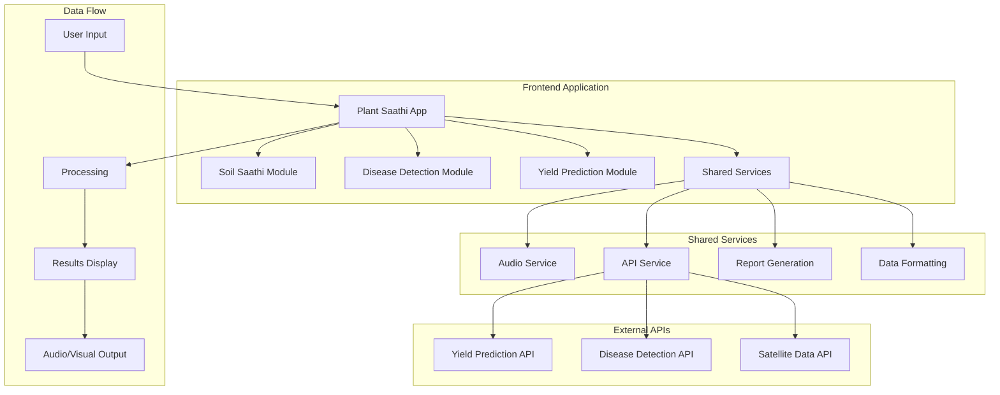

# Soil Saathi - Focused Soil Analysis Design Document

## Overview

This design document outlines the frontend architecture and implementation approach for the focused Soil Saathi module. The design centers exclusively on comprehensive vegetation indices analysis and derived NPK estimates based on satellite data and vegetation health indicators. The solution emphasizes farmer-friendly interfaces, accessibility through audio features, and comprehensive black box data collection for continuous model improvement.

## Architecture

### High-Level Architecture



### Component Architecture

The enhanced frontend follows a modular component architecture with shared services and utilities:

1. **Enhanced Soil Saathi Module**
   - Extended VegetationIndicesGrid component
   - NPK indicators display
   - Audio-enabled explanations

2. **Comprehensive Disease Detection Module**
   - DiseaseResultCard component
   - Treatment recommendations interface
   - Educational resources integration

3. **Yield Prediction Module**
   - YieldPredictionView component
   - API integration layer
   - Results visualization

4. **Shared Services**
   - AudioService for text-to-speech
   - APIService for backend communication
   - ReportService for PDF generation

## Components and Interfaces

### 1. Enhanced VegetationIndicesGrid Component

**Purpose**: Display extended vegetation indices with farmer-friendly explanations and audio support.

**Interface**:
```typescript
interface ExtendedVegetationIndices {
  // Existing indices
  ndvi: number;
  msavi: number;
  ndre: number;
  ndmi: number;
  rvi: number;
  soc_vis: number;
  
  // New indices
  ndwi: number;        // Water content in leaves
  rsm: number;         // Root zone soil moisture
  msavi2?: number;     // Enhanced soil-adjusted vegetation
  
  // Optional NPK indicators
  nitrogen?: number;
  phosphorus?: number;
  potassium?: number;
  npk_confidence?: number;
  
  status: string;
}

interface VegetationIndicesGridProps {
  indices: ExtendedVegetationIndices;
  playAudio: (text: string, id: string) => void;
  playingAudio: string | null;
}
```

**Key Features**:
- Display 8+ vegetation indices with optimal ranges
- Conditional NPK section (shown only when confidence > 0.7)
- Farmer-friendly explanations with emojis
- Audio playback for each index
- Visual trend indicators
- Status badges (Optimal, Monitor, Poor, Excess)

### 2. DiseaseResultCard Component

**Purpose**: Comprehensive display of disease detection results with treatment recommendations and educational resources.

**Interface**:
```typescript
interface DiseaseResult {
  disease_name: string;
  confidence: number;
  disease_stage: string;
  symptoms: string[];
  action_plan: string[];
  treatments: {
    organic: string[];
    chemical: string[];
    ipm: string[];
    cultural: string[];
  };
  recommended_videos: string[];
  faqs: Array<{ question: string; answer: string }>;
  tips: string[];
  yield_impact: "Low" | "Medium" | "High";
  spread_risk: "Low" | "Medium" | "High";
  recovery_chance: "Poor" | "Fair" | "Good" | "Excellent";
  model_version: string;
}

interface DiseaseResultCardProps {
  result: DiseaseResult;
  imageUrl: string;
  onRetake: () => void;
  playAudio: (text: string) => void;
}
```

**Key Features**:
- Image preview with analysis overlay
- Confidence percentage and disease stage
- Impact assessment badges (yield, spread, recovery)
- Tabbed treatment options (Organic, Chemical, IPM, Cultural)
- Expandable FAQ section
- Video tutorial links
- Audio explanations for key sections
- Download and share functionality

### 3. YieldPredictionView Component

**Purpose**: Display AI-powered yield predictions with confidence intervals and environmental factors.

**Interface**:
```typescript
interface YieldPrediction {
  predicted_yield: number;
  confidence: number;
  lower_bound?: number;
  upper_bound?: number;
  variety_characteristics?: {
    variety_name: string;
    maturity_days: number;
    yield_potential: number;
    drought_tolerance: string;
  };
  environmental_adjustments?: Record<string, number>;
  data_quality?: number;
}

interface YieldPredictionProps {
  fieldId: string;
}
```

**Key Features**:
- Main prediction display with confidence
- Yield range visualization
- Variety information card
- Environmental impact factors
- Data quality indicator
- Audio explanation of results
- Refresh and download options

### 4. AudioService

**Purpose**: Centralized text-to-speech functionality with queue management.

**Interface**:
```typescript
class AudioService {
  private currentUtterance: SpeechSynthesisUtterance | null;
  private isPlaying: boolean;
  
  speak(text: string, onStart?: () => void, onEnd?: () => void): void;
  stop(): void;
  isCurrentlyPlaying(): boolean;
}
```

**Features**:
- Queue management for audio playback
- Stop current audio when new audio starts
- Visual feedback during playback
- Error handling for unsupported browsers

## Data Models

### Extended Vegetation Indices Data Model

```typescript
interface VegetationIndicesData {
  // Core indices (existing)
  ndvi: number;          // 0.0 - 1.0
  msavi: number;         // 0.0 - 1.0
  ndre: number;          // 0.0 - 1.0
  ndmi: number;          // 0.0 - 1.0
  rvi: number;           // 1.0 - 10.0
  soc_vis: number;       // 0.0 - 1.0
  
  // Extended indices (new)
  ndwi: number;          // 0.0 - 1.0 (water content)
  rsm: number;           // 0.0 - 1.0 (root zone moisture)
  msavi2?: number;       // 0.0 - 1.0 (enhanced MSAVI)
  
  // NPK indicators (optional)
  nitrogen?: number;     // 0.0 - 5.0 (percentage)
  phosphorus?: number;   // 0.0 - 1.0 (percentage)
  potassium?: number;    // 0.0 - 3.0 (percentage)
  npk_confidence?: number; // 0.0 - 1.0
  
  status: "healthy" | "monitor" | "poor";
  timestamp: string;
}
```

### Disease Detection Data Model

```typescript
interface DiseaseDetectionResult {
  disease_name: string;
  confidence: number;    // 0.0 - 1.0
  disease_stage: "Early" | "Moderate" | "Severe" | "Critical";
  symptoms: string[];
  action_plan: string[];
  
  treatments: {
    organic: string[];
    chemical: string[];
    ipm: string[];      // Integrated Pest Management
    cultural: string[];
  };
  
  impact_assessment: {
    yield_impact: "Low" | "Medium" | "High";
    spread_risk: "Low" | "Medium" | "High";
    recovery_chance: "Poor" | "Fair" | "Good" | "Excellent";
  };
  
  educational_resources: {
    recommended_videos: string[];
    faqs: Array<{
      question: string;
      answer: string;
    }>;
    prevention_tips: string[];
  };
  
  metadata: {
    model_version: string;
    analysis_timestamp: string;
    image_quality_score?: number;
  };
}
```

### Yield Prediction Data Model

```typescript
interface YieldPredictionResult {
  predicted_yield: number;     // tons per hectare
  confidence: number;          // 0.0 - 1.0
  prediction_range: {
    lower_bound: number;
    upper_bound: number;
  };
  
  variety_info: {
    variety_name: string;
    maturity_days: number;
    yield_potential: number;
    drought_tolerance: "Low" | "Medium" | "High";
  };
  
  environmental_factors: {
    temperature_adjustment: number;
    rainfall_adjustment: number;
    soil_moisture_adjustment: number;
    pest_pressure_adjustment: number;
  };
  
  data_quality: number;        // 0.0 - 1.0
  prediction_timestamp: string;
}
```

## Error Handling

### API Error Handling Strategy

1. **Network Errors**
   - Display user-friendly error messages
   - Provide retry functionality
   - Show offline indicators when applicable

2. **Validation Errors**
   - Validate input data before API calls
   - Display specific field-level errors
   - Guide users to correct invalid inputs

3. **Service Unavailable**
   - Graceful degradation with cached data
   - Clear messaging about service status
   - Alternative action suggestions

### Error Display Components

```typescript
interface ErrorDisplayProps {
  error: {
    type: "network" | "validation" | "service" | "unknown";
    message: string;
    details?: string;
  };
  onRetry?: () => void;
  onDismiss?: () => void;
}
```

## Testing Strategy

### Component Testing Approach

1. **Unit Tests**
   - Individual component rendering
   - Props handling and state management
   - Audio service functionality
   - Data formatting utilities

2. **Integration Tests**
   - API service integration
   - Component interaction flows
   - Audio playback coordination
   - Error handling scenarios

3. **Accessibility Tests**
   - Screen reader compatibility
   - Keyboard navigation
   - Audio feature functionality
   - Color contrast compliance

### Test Coverage Areas

1. **Vegetation Indices Display**
   - Correct index calculations and display
   - NPK conditional rendering
   - Audio explanations accuracy
   - Status badge logic

2. **Disease Detection Results**
   - Result card rendering with all sections
   - Treatment categorization display
   - FAQ expansion functionality
   - Video link generation

3. **Yield Prediction Integration**
   - API call handling
   - Result visualization
   - Error state management
   - Confidence interval display

### Mock Data Strategy

Create comprehensive mock data sets for development and testing:

1. **Vegetation Indices Mock Data**
   - Various health scenarios (healthy, monitor, poor)
   - Different NPK confidence levels
   - Edge cases (extreme values)

2. **Disease Detection Mock Data**
   - Multiple disease types and stages
   - Comprehensive treatment options
   - Educational resource examples

3. **Yield Prediction Mock Data**
   - Different crop varieties
   - Various environmental conditions
   - Confidence level variations

## Performance Considerations

### Optimization Strategies

1. **Component Optimization**
   - React.memo for expensive components
   - useMemo for complex calculations
   - useCallback for event handlers

2. **Audio Performance**
   - Lazy loading of speech synthesis
   - Audio queue management
   - Memory cleanup for utterances

3. **API Integration**
   - Request debouncing
   - Response caching
   - Loading state management

4. **Bundle Optimization**
   - Code splitting for modules
   - Lazy loading of heavy components
   - Tree shaking for unused code

### Loading States and UX

1. **Progressive Loading**
   - Skeleton screens for data loading
   - Incremental content display
   - Smooth transitions between states

2. **Feedback Mechanisms**
   - Loading spinners for API calls
   - Progress indicators for multi-step processes
   - Success/error toast notifications

## Accessibility Features

### Audio Accessibility

1. **Text-to-Speech Integration**
   - Web Speech API implementation
   - Fallback for unsupported browsers
   - Voice selection and rate control

2. **Visual Indicators**
   - Audio playing animations
   - Clear audio control buttons
   - Visual feedback for audio states

### Screen Reader Support

1. **Semantic HTML**
   - Proper heading hierarchy
   - ARIA labels and descriptions
   - Role attributes for custom components

2. **Keyboard Navigation**
   - Tab order optimization
   - Focus management
   - Keyboard shortcuts for common actions

### Internationalization Considerations

1. **Text Content**
   - Farmer-friendly language
   - Regional agricultural terminology
   - Audio pronunciation accuracy

2. **Cultural Adaptations**
   - Local measurement units
   - Regional crop varieties
   - Cultural color associations

This design provides a comprehensive foundation for implementing the Plant Saathi AI frontend enhancements while maintaining code quality, accessibility, and user experience standards.